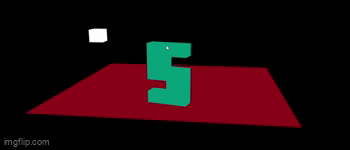

# Assignment 2: 3D Graphics and Interaction with WebGL

  - [Objective](#objective)
  - [Approach & Steps](#approach--steps)
    - [Initialization & Basics](#1-initialization--basics)
    - [Plane Construction](#2-plane-construction)
    - [3D Letter Construction](#3-3d-letter-construction)
    - [Illuminated Cube Construction)](#4-illuminated-cube-construction)
  - [Challenges & Learnings](#challenges--learnings)
  - [References & Resources](#references--resources)
  - [Feedback & Future Work](#feedback--future-work)
  - [Screenshots, Screencast & GIFs](#screenshots-screencast--gifs)
  - [Contribution & Collaboration](#contribution--collaboration)

## Objective
Create an interactive 3D scene with WebGL that showcases a personalized letter (letter) standing on an XZ plane, combined with lighting techniques from a designated light source (cube).
The letter and the cube should be able to take inputs from keyboard to move in the X and Z axes. In addition to that, we should allow the letter to do rotational and "jumping" movement. As for the cube, add a feature to activate/deactivate RGB light/color emitted by it.

## Approach & Steps
### 1. Initialization & Basics
- Start with the template code provided in the project repository. Which already includes the WebGL initialization.
- Add the function resizer() to make the canvas responsive to browser's window size.
- Differentiate the vertex shader and the fragment shader used by the cube and other than the cube those are the plane and the letter.
- Make functions for repetiting tasks: creating shader program, binding buffer, updating view, etc.

### 2. Plane Construction
- Initialize the matrices for the plane's position (vertices), color, faces (indices), and normals (orientation of surface).
- Initially I made the letter to almost fill up the plane's surface. But in the next objective, we should be able to play with the letter's position along the plane. So I make it smaller.

### 3. 3D Letter Construction
- The third letter in my nickname is 'S'. Because the letter's line is cursive and not straight, I decided to just make it if it is made with straight lines as it is easier for me to estimate the position of the vertices. That's why my 'S' is square.
- Some of the challenges in the 3d letter construction are: when the X Z axis is different from what you wanted it to be (ex: X axis means the side of the monitor, Z axis is the how close/far the object is from the viewer), repeating the pattern in the face matrix (indices) with different numbers.

### 4. Illuminated Cube Construction
- I basically take the code from previous lessons for the cube.
- The difference is we can change the cube's colors with keyboard.
- Also, with it being the light source, that is the biggest challenge I face when doing this assignment. Because until the first time I write the README, I still don't know what could solve it.

## Challenges & Learnings
The biggest challenge for this assignment is the lighting. I still cannot fully understand the components used to make an object appears illuminated. Because it is not as easy as copy-pasting the code from previous lessons. It is not as easy as _stealing_ someone's code in the forum or tell ChatGPT to make you illuminated cube. The lighting problems I faced are:
1. The illuminated cube does not appear illuminated.
2. It still cannot function as a light source.
3. Other people's code cannot always fit perfectly in your code (I use the code from previous lessons, my cube is not yet a light source. My friend tweak it a little, it kind of working. But when I follow his path, my letter does not even appear).

## References & Resources
List all the external resources, references, tutorials, or documentation you've consulted during the assignment:
- [Getting uniform location problem](https://stackoverflow.com/questions/14413713/webgl-invalid-operation-uniform1i-location-not-for-current-program)

## Feedback & Future Work
For me, this lighting topic is hard to make it work for the problems/reasons I have stated above.

## Screenshots, Screencast & GIFs

## Contribution & Collaboration
- Big thanks to Apta for assissting me with the keyboard input problem and many things related to inputs and Dimas.
- Both gave me a headstart hoping to discuss the problem with the lighting together...